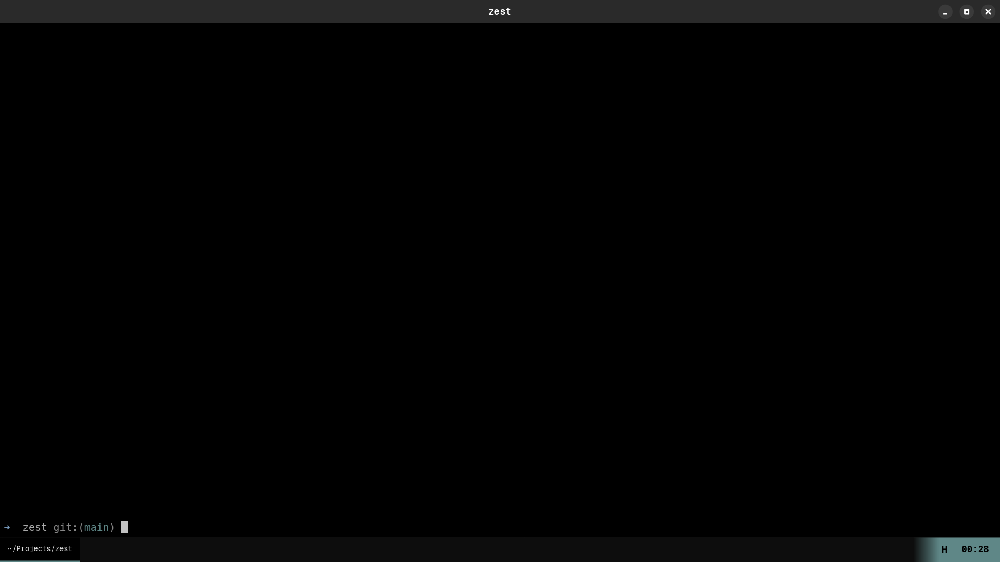

#  Zest

**Zest** is a GPU-accelerated terminal emulator written in [Zig](https://ziglang.org/). It is engineered for extreme performance, low latency, and a premium "Black Metal Immortal" aesthetic.

<p align="center">
  
</p>

<p align="center">
  
</p>

---

## Why Zest?

Most terminal emulators render text on the CPU and push pixels to the GPU as a final step. Zest does the opposite: it renders text **directly on the GPU** using a custom OpenGL ES 3.2 pipeline. The result is buttery-smooth scrolling, instant text rendering, and a tiny memory footprint.

| Aspect | Traditional Terminals | Zest |
|---|---|---|
| Text rendering | CPU (Pango/HarfBuzz → Cairo → surface) | GPU (FreeType → texture atlas → single-pass shader) |
| Scroll performance | Re-layout + re-draw per frame | Row-index rotation + vertex buffer rebuild |
| Emoji support | Font fallback chains, slow | Dedicated BGRA glyph slot in atlas |
| Memory | Hundreds of MB | ~30-50 MB |
| Binary size | 5-20 MB | ~12 MB |

---

## Architecture

```
─────────────────────────────────────────────────────────────┐
│                        GTK4 Window                           │
│  ┌───────────────────────────────────────────────────────  │
│  │                    GtkGLArea                           │  │
│  │  ─────────────────────────────────────────────────┐  │  │
│  │  │              OpenGL ES 3.2 Renderer              │  │  │
│  │  │  ──────────┐  ┌──────────┐  ┌───────────────┐  │  │  │
│  │  │  │  Shader  │  │  Atlas   │  │  Vertex Buf   │  │  │  │
│  │  │  │ Program  │  │ 2048×2048│  │  (pre-alloc)  │  │  │  │
│  │  │  └──────────┘  └──────────┘  └───────────────┘  │  │  │
│  │  ─────────────────────────────────────────────────┘  │  │
│  └───────────────────────────────────────────────────────┘  │
│  ┌───────────────────────────────────────────────────────┐  │
│  │                    Tab Bar                             │  │
│  │  [Tab] [Tab] [Tab] ... [+] [scrollable]  [ 19:05 ]    │  │
│  ───────────────────────────────────────────────────────┘  │
└─────────────────────────────────────────────────────────────┘
         ▲                                              │
         │  feed()                                      │ read()
┌────────┴────────                          ┌──────────┴──────┐
│   Terminal.zig  │◄─────────────────────────│    Pty.zig      │
│  (VTE Parser)   │                          │  (forkpty)      │
│  ANSI/CSI/OSC   │                          │  non-blocking   │
└────────┬────────┘                          └──────────┬──────┘
         │                                              │
┌────────┴────────                          ┌──────────┴──────
│    Grid.zig     │                          │   Shell Process │
│  (row-index     │                          │  ($SHELL)       │
│   indirection)  │                          │                 │
────────┬────────┘                          └─────────────────┘
         │
────────┴────────┐
│    Cell.zig     │
│  (char+fg+bg    │
│   +attrs)       │
└─────────────────┘
```

### Data Flow

1. **Shell** writes output to the PTY master
2. **Pty.zig** reads non-blocking (~60Hz tick) into a 64KB buffer
3. **Terminal.zig** parses ANSI/CSI/OSC escape sequences, updating cell state
4. **Grid.zig** stores cells with O(1) scroll via row-index rotation
5. **Renderer.zig** builds vertex buffer from grid, draws via single-pass shader
6. **GtkGLArea** presents the frame on the display

---

## Features

### Rendering
- **OpenGL ES 3.2** single-pass shader pipeline (vertex + fragment shader)
- **2048×2048 dynamic glyph texture atlas** with row-packing allocator
- **FreeType2** font rasterization with LCD subpixel filtering

### Terminal Emulation
- Full **ANSI/CSI/OSC escape sequence parser** with state machine
- **256-color palette** (16 ANSI + 6×6×6 color cube + 24 grayscale levels)
- **24-bit true color** (`ESC[38;2;R;G;Bm`)
- **SGR attributes**: bold, italic, underline, strikethrough, dim, inverse, blink
- **Alt screen buffer** (DECSET 1049) for fullscreen apps like vim/htop
- **Scrolling regions** (DECSTBM)
- **Insert/delete characters and lines**
- **Bracketed paste mode** (DECSET 2004)
- **Cursor key mode** (DECSET 1)
- **Save/restore cursor** (DECSC/DECRC)
- **UTF-8 multi-byte character decoding**

### Layout
- **Pane splitting** (horizontal and vertical) via binary tree
- **Pane navigation** (up/down/left/right) via distance-based heuristic
- **Pane closing** with automatic focus transfer
- **Automatic resize** recalculating cell counts per pane
- **Split line borders** rendered via OpenGL scissor test

### Tabs
- **Multiple tabs** with horizontally scrollable tab bar
- **Tab titles** auto-updated from pane CWD (via `/proc/<pid>/cwd`)
- **Gradient right section** blending tab area into terminal background
- **Live clock** (HH:MM) in the tab bar
- **Keyboard shortcuts**: `Ctrl+Tab` / `Ctrl+Shift+Tab` / `Ctrl+PageUp` / `Ctrl+PageDown`

### Theming
- **"Black Metal Immortal"** Base16 theme — pure black background with grey/teal/steel blue palette
- **GTK4 CSS** for tab bar styling (dark theme with accent color underline on active tab)

### Input
- **GTK4 event controllers**: key, motion, click gesture, scroll
- **GTK IM context** for Unicode text input (IME support)
- **Native Wayland/X11** with automatic fractional scaling (no blurry rendering)

---

## Keybindings

### Tab Management
| Shortcut | Action |
|---|---|
| `Ctrl+Tab` | Next tab |
| `Ctrl+Shift+Tab` | Previous tab |
| `Ctrl+PageDown` | Next tab |
| `Ctrl+PageUp` | Previous tab |
| `Ctrl+Shift+T` | New tab |
| `Ctrl+Shift+W` | Close active tab |

### Pane Management
| Shortcut | Action |
|---|---|
| `Ctrl+Shift+H` | Split pane horizontally |
| `Ctrl+Shift+J` | Split pane vertically |
| `Ctrl+Shift+X` | Close focused pane |
| `Ctrl+Shift+←` | Focus pane to the left |
| `Ctrl+Shift+↑` | Focus pane above |
| `Ctrl+Shift+→` | Focus pane to the right |
| `Ctrl+Shift+↓` | Focus pane below |

### Clipboard
| Shortcut | Action |
|---|---|
| `Ctrl+Shift+C` | Copy selected text |
| `Ctrl+Shift+V` | Paste from clipboard |

---

## Project Structure

```
zest/
├── src/
│   ├── main.zig                  # Entry point, GTK4 lifecycle, tab/clock UI, input handling
│   ├── gl.zig                    # Re-exports all C bindings
│   ├── c_gl.h / c_ft.h / c_pty.h / c_fc.h  # C headers for translate-c
│   ├── apprt/
│   │   ├── gtk.zig               # GTK4 runtime abstraction (unused, legacy)
│   │   └── gtk/key.zig           # GDK key codes, modifier translation, escape sequences
│   ├── layout/
│   │   ├── Pane.zig              # Single pane: Terminal + Pty + geometry
│   │   ├── PaneManager.zig       # High-level pane management, resize, split lines
│   │   ├── PaneTree.zig          # Binary tree of panes (leaf/split nodes)
│   │   └── KeyBindings.zig       # Command enum and shortcut handler
│   ├── pty/
│   │   ├── Pty.zig               # POSIX PTY (forkpty, non-blocking I/O)
│   │   └── ConPty.zig            # Windows ConPty backend (partial)
│   ├── renderer/
│   │   ├── Renderer.zig          # OpenGL ES 3.2 renderer, VAO/VBO, shaders
│   │   ├── Font.zig              # FreeType font loading, glyph metrics, emoji detection
│   │   ├── FontConfig.zig        # Fontconfig bindings for system font discovery
│   │   └── Atlas.zig             # 2048×2048 GPU texture atlas, glyph rasterization
│   └── terminal/
│       ├── Terminal.zig          # VTE state machine + ANSI/CSI/OSC parser
│       ├── Grid.zig              # 2D cell grid with row-index indirection
│       ├── Cell.zig              # Cell struct + Black Metal Immortal color theme
│       └── RingBuffer.zig        # Circular byte buffer (defined, unused)
── assets/                       # Icons (PNG, ICO, ICNS)
├── build.zig                     # Zig build script
├── build.zig.zon                 # Package manifest (v0.5.0)
└── README.md                     # This file
```

---

## Technical Details

### Why OpenGL ES 3.2?

GTK4 on Wayland uses an EGL context that only exposes OpenGL ES functions. Zest targets **GLES 3.2** (`#version 320 es`) for maximum compatibility across Wayland compositors while still supporting all features needed for terminal rendering.

### Why Raw `extern fn` Declarations?

Zig 0.17.0-dev's `@cImport` cannot handle GTK4's complex macro-heavy headers. Zest uses hand-written `extern fn` declarations for the ~60 GTK4 functions it needs, avoiding the overhead of a full bindings generator.

### Glyph Atlas Strategy

The 2048×2048 texture atlas uses a simple row-packing allocator:
- **Grayscale glyphs** (monospace font): 1-channel, LCD subpixel filtered
- **Color emoji glyphs** (Noto Color Emoji, etc.): 4-channel BGRA, scaled to fit cell slot
- **Block characters** (U+2580–U+259F): procedurally generated, no FreeType needed

When the atlas fills up, it is cleared and all visible glyphs are re-rasterized. This rarely happens in practice since most terminal sessions use a small subset of Unicode.

### Scroll Optimization

Instead of copying cell data on scroll, Grid.zig maintains a `row_indices` array that maps logical row numbers to physical row storage. Scrolling rotates this array in O(1), and only the newly exposed row needs to be cleared.

---

## Getting Started

### Prerequisites

| Dependency | Purpose |
|---|---|
| [Zig](https://ziglang.org/) 0.17.0-dev | Compiler |
| GTK4 | Windowing, input, GLArea |
| FreeType2 | Font rasterization |
| libepoxy | OpenGL function dispatch |
| Pango / Cairo | GTK4 text layout (indirect) |
| Fontconfig | System font discovery |
| HarfBuzz | Text shaping (indirect via Pango) |

**Debian/Ubuntu:**
```bash
sudo apt install zig gtk-4-dev libfreetype-dev libepoxy-dev \
  libpango1.0-dev libcairo2-dev libfontconfig1-dev libharfbuzz-dev
```

**Fedora:**
```bash
sudo dnf install zig gtk4-devel freetype-devel libepoxy-devel \
  pango-devel cairo-devel fontconfig-devel harfbuzz-devel
```

**Arch Linux:**
```bash
sudo pacman -S zig gtk4 freetype2 libepoxy pango cairo fontconfig harfbuzz
```

### Build

```bash
git clone https://github.com/Jayanth1312/zest.git
cd zest
zig build -Doptimize=ReleaseSafe
```

### Run

```bash
./zig-out/bin/zest
```

### Debug Build

```bash
zig build -Doptimize=Debug
./zig-out/bin/zest
```

---

## Configuration

Zest currently has **no user-facing configuration files**. All settings are hardcoded in the source:

| Setting | Value | Location |
|---|---|---|
| Font | DejaVu Sans Mono → Liberation Mono → Ubuntu Mono | `main.zig` |
| Font size | 32px | `main.zig` |
| Initial grid | 120 cols × 35 rows | `main.zig` |
| Window size | 1280×720 | `main.zig` |
| Shell | `$SHELL` or `/bin/sh` | `Pty.zig` |
| TERM | `xterm-256color` | `Pty.zig` |
| Atlas size | 2048×2048 | `Atlas.zig` |
| PTY read buffer | 65536 bytes | `main.zig` |
| Theme | Black Metal Immortal (Base16) | `Cell.zig` |

Configuration file support is planned for a future release.

---

## Platform Support

| Platform | Status | Backend |
|---|---|---|
| Linux (Wayland) | ✅ Supported | GTK4 + EGL + GLES 3.2 |
| Linux (X11) | ✅ Supported | GTK4 + GLX |
| macOS | ⚠️ Partial | GLFW (legacy, GTK4 migration pending) |
| Windows | ⚠️ Partial | ConPty backend exists, process spawning incomplete |

---

## Roadmap

- [ ] User configuration file (JSON/TOML)
- [ ] Font size adjustment (`Ctrl++` / `Ctrl+-`)
- [ ] Search functionality (`Ctrl+Shift+F`)
- [ ] Link detection and clickable URLs
- [ ] Bell notification (visual + audio)
- [ ] Full macOS GTK4 support
- [ ] Complete Windows ConPty support
- [ ] Ligature support
- [ ] Transparency/blur background
- [ ] Custom color themes
- [ ] Session persistence (save/restore tabs and panes)

---

## Contributing

Contributions are welcome! Areas that need help:

- **macOS GTK4 migration** — migrate from GLFW to GTK4
- **Windows ConPty** — complete process spawning
- **Configuration system** — design and implement user config
- **Testing** — terminal escape sequence conformance tests
- **Documentation** — improve docs, add screenshots

Please open an issue before starting work on larger features.

---

## License

This project does not yet have a license file. A permissive license (MIT or Apache 2.0) will be added soon.

---

Built with ⚡ by [Jayanth](https://github.com/Jayanth1312)
